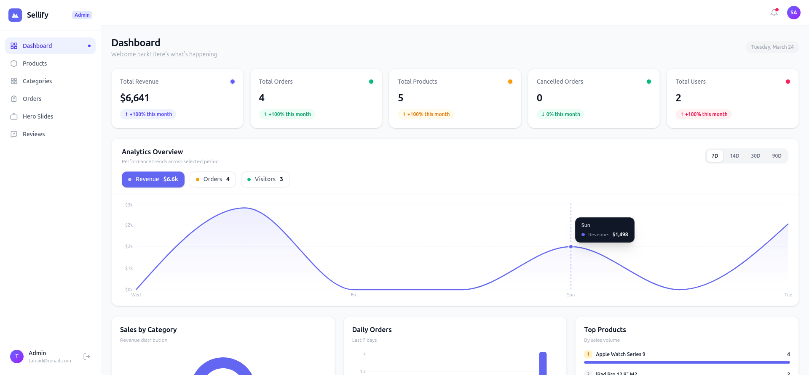
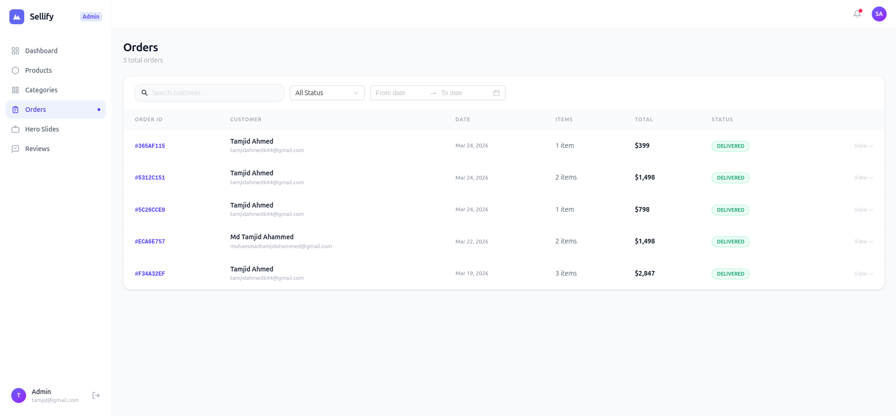
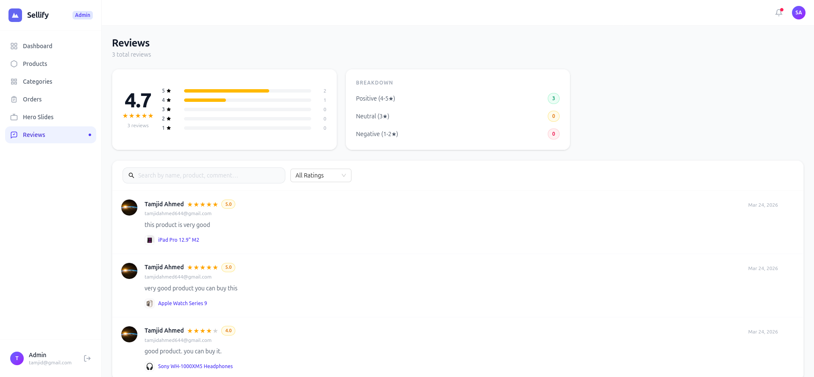

# Sellify Admin Dashboard

<div align="center">


**A production-grade e-commerce admin dashboard built with React + Vite and NestJS.**
Manage products, orders, reviews, hero slides and analytics — all in one place.

</div>

---

## Related Repositories

This project is part of the Sellify ecosystem. All three repositories work together.

| Repository | Description | Link |
|------------|-------------|------|
| **sellify-server** | NestJS backend — shared by both frontend apps | [sellify-server](https://github.com/tamjidahmed0/sellify-server) |
| **sellify** | Main e-commerce storefront (Next.js) | [sellify](https://github.com/tamjidahmed0/sellify) |

---

## Screenshots







---

## Features

- **Dashboard** — Revenue, orders, cancelled stats with time-series charts and category breakdown
- **Products** — Full CRUD with image upload (thumbnail + gallery), categories, stock management
- **Categories** — Create, edit, delete with Cloudinary image support
- **Orders** — Filter by status/date/search, inline status update, detail page with timeline
- **Hero Slides** — Manage homepage carousel slides with image upload
- **Reviews** — View and moderate product reviews with rating distribution
- **Auth** — JWT-based admin authentication with route protection

---

## Getting Started

### Prerequisites

Make sure you have the following installed:

- **Node.js** v18+
- **pnpm** / **npm** / **yarn**
- **PostgreSQL** running locally or a cloud instance
- A **Cloudinary** account

---

### 1. Clone the repository

```bash
git clone https://github.com/tamjidahmed0/sellify-admin.git
cd sellify-admin
```

---

### 2. Install dependencies

```bash
npm install
# or
pnpm install
```

---

### 3. Configure environment variables

Create a `.env` file in the root:

```env
VITE_API_URL=http://localhost:4000
```

---

### 4. Run the development server

```bash
npm run dev
```

The app will be available at **http://localhost:5173**

---

### 5. Build for production

```bash
npm run build
```

Preview the production build:

```bash
npm run preview
```

---

## Backend Setup

The backend is in a separate repository. Follow the setup instructions there:

[sellify-server](https://github.com/tamjidahmed0/sellify-server)

---

## Tech Stack

### Frontend

| Tech | Purpose |
|------|---------|
| React 19 + Vite | UI framework & bundler |
| TypeScript | Type safety |
| Tailwind CSS | Styling |
| Ant Design | UI components |
| TanStack Query | Server state management |
| React Router v7 | Routing |
| Recharts | Charts & analytics |

### Backend

| Tech | Purpose |
|------|---------|
| NestJS | Backend framework |
| Prisma | ORM |
| PostgreSQL | Database |
| JWT + Passport | Authentication |
| Stripe | Payment processing |
| Cloudinary | Image storage |


## Auth Flow

```
Admin logs in → POST /auth/login
  → JWT token stored in Cookie (2hr expiry)
  → ProtectedRoute verifies token on every load
  → Token expired → redirect to /login
```

---

